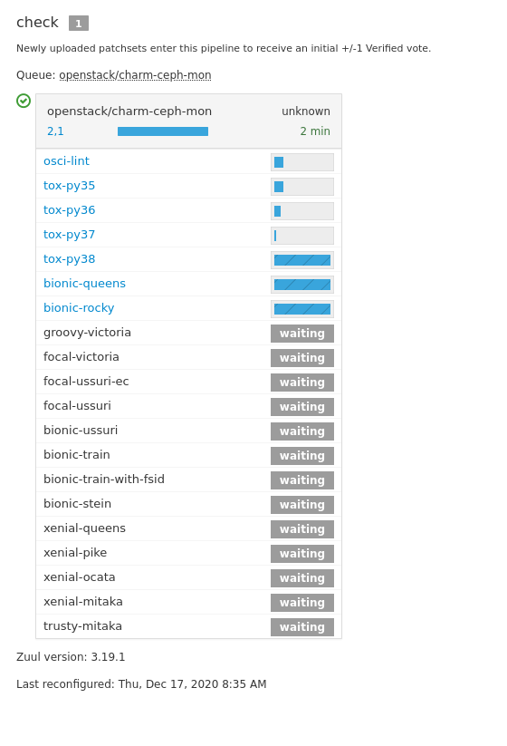
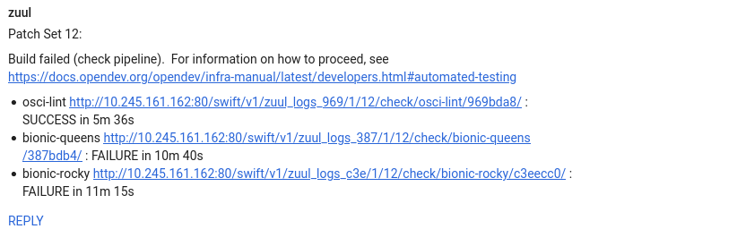
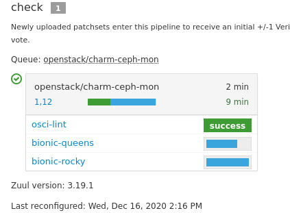

# OSCI using Zuul

To use Zuul in place of Jenkins for Ubuntu's OpenStack CI (OSCI), it's worth
starting with a basic evaluation of what tasks OSCI currently performs for us
and ensuring that we can do the same things with Zuul. There are a few
differences depending on if a charm is reactive, classic, or other (such
as operator); however, we can generally summarize them the same:

1. lint
1. unit tests
1. (optionally) build the charm
1. (optionally) lint built charm
1. (optionally) unit test built charm
1. run zaza on a deployable charm

The last line above deserves special attention. With OSCI, the last step is
performed with the `func-smoke` or `func` `tox` targets, asking Zaza to run
the whole test suite in series, for example: 

```
bionic-stein -> bionic-rocky -> bionic-queens
```

In addition to the test lifecycle above, OSCI Jenkins also performs release
related tasks such as publishing artifacts to the charmstore and scheduled
versions of the above as well.

With Zuul, we can configure the functional testing to be performed in a more
parallel fashion, with steps optionally depending on a step before them. For
example, it's possible for us to have jobs defined such that a `charm-build`
job is performed before a `func-test` job. In addition, jobs would be defined
in a more centralized fashion, by default, without restricting our ability to
define jobs in a specific repo.

Zuul can run scheduled tasks as well, so we should be able to replicate our
regularly scheduled test runs as desired.

It is possible for us to define pipelines for different parts of the change
lifecycle, so that we could add a job to Zuul to publish resources after the
change has landed upstream but that hasn't been encoded in this evaluation.

To further explore what this looks like, the following sections will describe
common tasks that must be performed and what they look like for both Jenkins
and Zuul.

## Example tasks

### Add a new release combination

To add a new release combination to a charm under our traditional Jenkins,
a developer must touch every charm to add a new line into `tests/tests.yaml`
so that Zaza will add it to the test matrix for that charm. With Zuul, we can
easily have a [centralized location](./zuul.d/project-templates.yaml) where we
can define common jobs. Adding a new release combination to our Zuul tests is
as easy as adding the new item to the default jobs that we run for every charm.

### Adding a secret

Place the secret in a file and use zuul-client to generate the configuration
snippet for you:

```
    ZUUL_API_EP=X.X.X.X
    NAME_OF_KEY="ldap_secret"
    echo "My secret" > /tmp/secret
    zuul-client --zuul-url http://${ZUUL_API_EP} encrypt \
        --project 'github.com/openstack-charmers/zosci-config' \
        --tenant openstack --infile /tmp/secret  \
        --secret-name ${NAME_OF_KEY} --field-name value
```

The snippet can then be added [secrets config](.zuul.d/secrets.yaml). For more
information see
[zuul encryption](https://zuul-ci.org/docs/zuul/discussion/encryption.html)

### Run a functional test

When a developer wants to test their changes in OSCI, the current setup
defaults to just running a smoke test. One downside of this is that all
supported release combinations aren't tested for every change; however, it
does allow us to get test results on a change reasonably quickly (around an
hour, generally).

With Zuul, the approach would be to define the functional test jobs so that
they can be run in parallel, but that they should use a `Semaphore` from Zuul
to control concurrency. This would allow us to control the number of automated
models that are being created at once with a fair degree of accuracy.

### Retry a failed functional full test

When a single test failed in a recheck-full, that failure blocks all other
tests from completing, as well as being impossible to retry directly, so a new
rechec-full is required which may fail on a different deploy. There are many
potential causes of transient failure with a Juju model deploy, so this can be
a difficult process to work through.

With Zuul, it's possible, and enabled by default, to have jobs be retried.
Along with the ability to configure each job independently, this means that
each of our functional test models would be allowed to retry by default,
helping us to reduce the need for full retries to resolve a transient test
failure.

### Add a custom test to a charm

To add a custom test to a charm is, with Jenkins, similar to adding a new
release combination, except it's just for a single charm. Adding a new test
to a specific charm in Zuul is fairly similar, except that it needs to be added
to the charm's local zuul configuration file. An example of a custom job is:

```yaml
- job:
    name: focal-ussuri-ec
    description: |
      Run a functional test. This test is defined in the
      ceph-mon charm itself.
    parent: func-target
    vars:
      tox_extra_args: '-- focal-ussuri-ec'
```

This job was taken from the ceph-mon charm to ensure that we can use both
centrally defined jobs as well as charm-local jobs to customize the tests.

## Adding Zuul OSCI support to a charm

To add support for the new Zuul to a charm is a fairly simple process.
First, the charm should be added to [projects.yaml](./zuul.d/projects.yaml) in
this repository. After that, a new file to configure the charm should be added
to the charm in question, named `osci.yaml`. An example that can be used as a
guide for any charm is:

```yaml
- project:
    templates:
      - charm-unit-jobs
      - charm-functional-jobs
```

The above configuration will run the named
[project-templates](./zuul.d/project-template.yaml) which, currently, would
run the following unit test type jobs:

```
- osci-lint
- tox-py35
- tox-py36
- tox-py37
- tox-py38
```

and these functional jobs:

```
- focal-wallaby
- focal-victoria
- focal-ussuri-ec
- focal-ussuri
- bionic-ussuri
- bionic-train
- bionic-train-with-fsid
- bionic-stein
- bionic-rocky
- bionic-queens
- xenial-queens
- xenial-pike
- xenial-ocata
- xenial-mitaka
- trusty-mitaka
```

With the above defaults, as well as charm-specific configuration to enable
the custom test requirements, Zuul shows us the following for the ceph-mon
charm:



## Reporting on Gerrit

When Jenkins reports a test failure on Gerrit today, we can see the results
of the unit and lint tests, but all of the functional tests are treated as an
opaque blob to gerrit.

With Zuul, the reports to Gerrit include each job that is run, allowing us to
see granular results:



The above results were posted after a partially successful run of a subset
of the Ceph example above:



## Potential improvements

### Per test OpenStack tenant

There are some possible improvements over the current example presented here,
including potentially creating a new OpenStack tenant for each functional test.
Because we control the test environment via ansible, it would be possible to
create a tenant in the setup stages of a functional test, and remove that
tenant's resources and the tenant itself in a cleanup stage.
